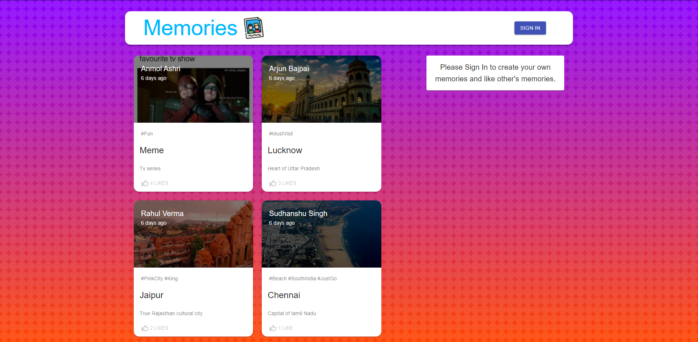
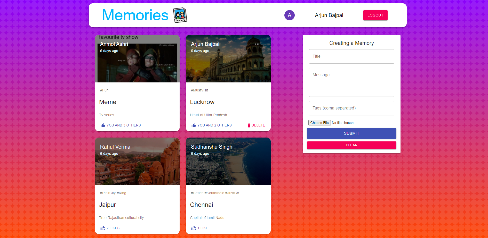
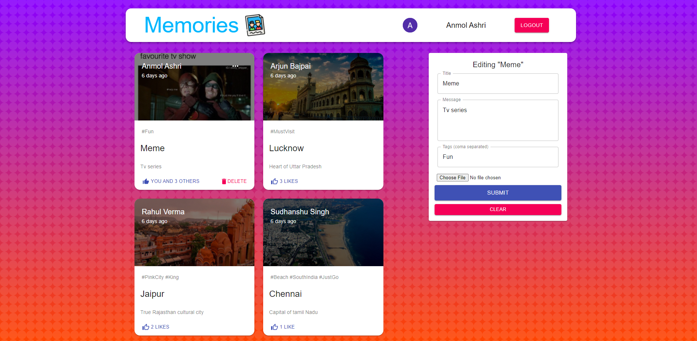

# Memory Keeper is a MERN stack application 

### This web application provides user to create his/her memory blog with all social media tags and features to like others post. User can create, delete and edit his/her post. To create, like user has to create account either sign up manaually or with google authentication. If user forget to logout while leaving this app ; this app automatically log outs user which provide more security.

