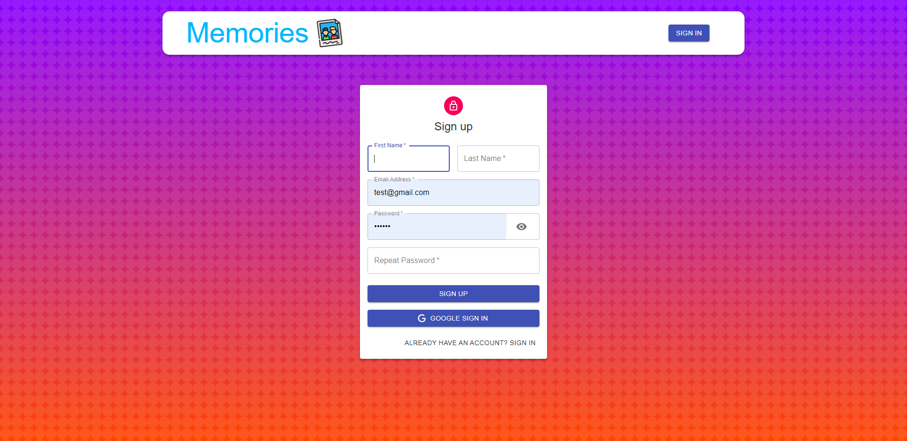
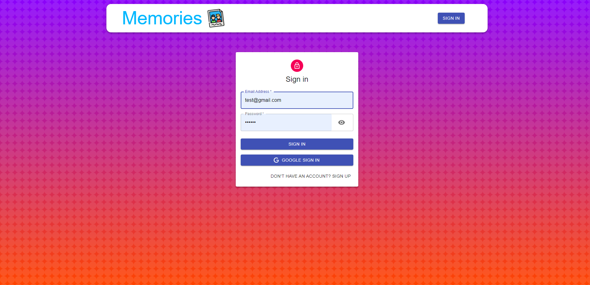

# Memory Keeper is a MERN stack application 

## Application made using MERN stack with jwt auth and google authentication.

### This web application provides user to create his/her memory blog with all social media tags and features to like others post. User can create, delete and edit his/her post. To create, like user has to create account either sign up manaually or with google authentication. If user forget to logout while leaving this app ; this app automatically log outs user which provide more security.

### Intial Page

### SignUp Form to create account.

### SignIn form 

### Main page after login , as you can see a user can only edit or delete his/her own post but can like/unlike others post.

### Edit Form when user edits his/her own post.
